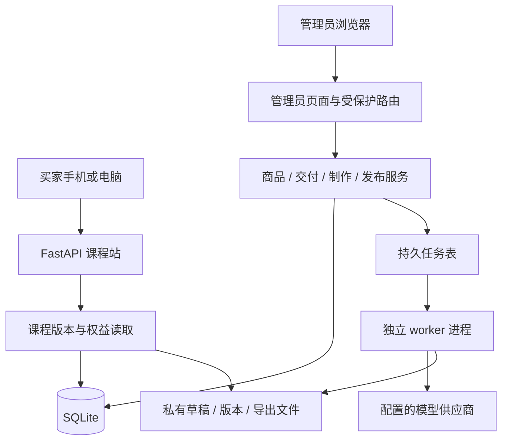

# Coursmith 下一阶段路线：内部业务管理平台

日期：2026-10-02。状态：总体方向及 M1 设计规格已获用户确认；M1 逐文件实施计划另行评审，M2–M4 仍须各自细化并验收；本文不是已实施功能清单。

## 1. 目标与已确认边界

把 Coursmith 从“脚本生产 + CLI 发布/发码”推进到可日常运营的内部业务平台。管理员在网页中完成商品准备、资料制作、审核、发布、店铺成交后的发码、访问恢复和问题处理；消费者继续在第三方店铺付款，在手机或电脑浏览器学习。

已确认：

- 第一版由项目所有者一人使用，数据保留操作者标识，预留多人扩展。
- 交易继续在第三方店铺完成；课程站交付，不建设站内支付。
- 商品品类不限于技术内容，分类可配置；试运营以 Agent 开发为主，AI Infra 可作为下一门。
- 生产工具仅内部使用；现阶段不开放用户自行生成、按次制作付费或付费导出。
- 在线阅读是默认交付形式，PDF 是辅助形式；HTML/ZIP 是否交付由商品授权设置决定。

规划建议、尚未作为商业承诺：

- 保留 Python 3.11+、FastAPI、Jinja2、SQLite 和本地文件；增加独立任务进程。
- 首先完成“运营后台与交付”，再完成“制作工作台与版本发布”。
- 商品须明确填写访问时长、更新规则和可下载格式；系统不替经营者承诺永久访问或固定服务年限。
- 最多三个有效设备会话、任务并发数和输入限额均为第一版技术默认值，可以在后续规格评审中调整。

## 2. 基于当前代码的起点

本规划以工作区当前代码为准，包含上一轮尚未提交的修正。分支为 `codex/commercial-course-v1`，当前提交为 `3ab0412`。上一轮记录的 33 项测试通过只是当时结果，本次规划没有重新执行测试或改变业务代码。

| 当前能力/缺口 | 代码依据 | 对下一阶段的影响 |
| --- | --- | --- |
| 有课程目录、试学、兑换、授权阅读与进度 API | `course_platform/app.py`、`access.py` | 可以作为内部后台的交付基础 |
| 未实现管理员账号、订单关联、批次发码和权限撤销 | `database.py` 的现有六张表 | 不能直接靠网页表单调用现有单码函数完成运营闭环 |
| 学习进度绑定短期会话，默认 72 小时；兑换码只能用一次 | `settings.py`、`access.py` | 换设备、清 Cookie、会话到期后的权益需要单独保存与恢复 |
| 生成器将内容包在脚本驱动的 iframe 中 | `course_gen_core.py:build_chapter_wrapper_html()` | 与当前禁止 script/iframe 的课程包验证器冲突，须增加安全的生产输出方式 |
| 生成失败被打印后吞掉，章节结果未汇总为业务失败 | `save_html_response()`、`generate_lessons_from_outlines()` | 后台不能把“函数返回”当成“制作成功” |
| 生成依赖全局变量和工作目录切换 | `run_full_pipeline_for_titles()` | 长任务必须隔离，生产接口要显式传递参数与目录 |
| 目录在应用创建时载入 | `_load_catalog()`、`create_app()` | 网页发布、下架、回滚必须改成数据库驱动的版本读取 |
| 发布同 slug 直接拒绝覆盖 | `content.py:publish_course()` | 需要独立版本目录和活动版本指针，而非覆盖旧目录 |
| 学习页面有进度描述，但没有用户可操作的完成按钮 | `templates/learn_home.html` | 后续交付界面必须补可点击的完成/取消完成入口 |
| 当前示例章节偏概要、来源台账仅列少量站点 | `content/courses/agent-development/` | 只能作为工程样例；通过结构验证不等于已具备销售质量 |
| 当前导出只覆盖基础单元测试，模板未声明 wheel 包内资源 | `export.py`、`pyproject.toml` | 需要真实浏览器导出和打包安装测试，防止部署后缺模板/静态文件 |

还需在交付子项目处理：兑换失败审计位于随后抛异常的事务内，可能随事务回滚而丢失；公开素材路由未区分试学素材与付费素材。两者都影响后台排查和商品交付。

## 3. 三种技术路线

| 路线 | 优点 | 代价 | 本阶段判断 |
| --- | --- | --- | --- |
| FastAPI + Jinja2 + 自有 CSS/少量 JS + 独立 worker | 延续现有仓库；表单、表格、分步制作都可实现；部署单一代码版本 | 富文本、拖拽和复杂实时视图需要后续增强 | 推荐 |
| FastAPI API + Vue/React 管理端 | 适合复杂编辑、拖拽和多面板交互 | 新增前端构建、契约、依赖和部署维护 | 明确出现复杂编辑需求后再评估 |
| 新建 Django 管理系统或接入低代码后台 | 数据 CRUD 能较快铺开 | 仍要实现生成任务/审核/发布流程，并产生两套认证、模型或系统集成 | 不作为当前默认路线 |

这是依据现有代码和单人运营需求作出的项目选择，不表示第一条路线在所有规模下最优。

## 4. 页面与日常操作

后台位于 `/admin`，采用独立布局、登录与会话，不与买家的授权 Cookie 混用。桌面端侧边栏 + 内容区，手机端折叠菜单；操作按钮、结果提示和错误恢复均使用中文。

| 导航 | 页面内容 | 关键操作 |
| --- | --- | --- |
| 工作台 | 待审核、失败任务、待交付订单、已发布商品、最近操作 | 从问题或待办直接进入对象详情 |
| 商品库 | 分类、商品信息、适合人群、学习目标、销售渠道、交付政策、状态 | 新建、编辑、复制为草稿、停发新码、查看公开页 |
| 制作工作台 | 需求单、大纲、章节源文档、素材、来源台账、预览 | 生成大纲、修改并确认大纲、逐章生成、保存编辑、仅重做失败章节 |
| 任务中心 | 排队/进行中/中断/失败/完成、分步结果、调用记录、产物 | 查看、取消、手动恢复、下载允许的产物 |
| 审核与发布 | 结构检查、人工审核、版本差异、发布记录、下载状态 | 退回修改、批准固定内容快照、发布新版本、回滚 |
| 兑换与交付 | 发码批次、订单记录、兑换结果、持久权益、售后记录 | 单码/批量发码、复制发货文案、作废未使用码、补发、恢复访问、撤销权益 |
| 系统 | 模型连接状态、非敏感模板配置、worker 心跳、备份状态、操作日志 | 测试连接、编辑非敏感配置、手动备份、查看健康状态 |

统计口径必须透明：本阶段只有人工录入的店铺订单，不宣称平台自动核实了成交；没有模型使用量或售价快照时显示“未记录”，不以零成本或零利润代替。

制作向导：


页面不是终端输出的截图。它应明确显示“做了哪些章节、哪些失败、还差什么才能发布、该怎样处理”，不要求经营者解释 traceback。

## 5. 总体架构与共同约束



- Web 请求只提交任务或处理短事务；模型调用、批量生成、PDF/ZIP 导出不在请求中运行。
- 第一版一台主机、一个 web 实例和一个 worker，SQLite 放在同机本地磁盘。长任务执行器不是 Web 进程里的后台线程。
- SQLite 使用 WAL、外键、`busy_timeout=5000`，交易写入采用短事务；模型和浏览器运行时不持有数据库写锁。WAL 仍只有一个写入者，不能据此承诺多机扩展。[SQLite 官方说明](https://sqlite.org/wal.html)
- 采用 `app` 工厂/生命周期注入服务，导入模块不应自动迁移数据库、扫描生产文件或启动 worker。
- 部署锁定一组经过集成测试的依赖，CI 安装同一锁定结果。当前已有依赖范围不能替代可重复安装记录。
- CLI、网页和未来机器人调用同一业务服务；网页不拼接管理员输入去执行 shell 命令。
- 路由划分后各模块职责保持清晰，不再把后台全部加入 `app.py` 的嵌套函数。
- 默认的首次配置、服务启动、数据库恢复仍属于部署运维；日常商品操作全部通过网页完成。

选择独立 worker 的原因是任务可持续数分钟至数十分钟，且必须跨 Web 重启保存状态；FastAPI 官方也将较重的跨进程任务与简短 `BackgroundTasks` 用例区别讨论。本项目的持久化与恢复策略属于自己的设计。[FastAPI Background Tasks](https://fastapi.tiangolo.com/tutorial/background-tasks/)

## 6. 制作工作台子项目：具体边界

此部分是后续子项目的设计输入，需在进入实施前形成独立书面规格。

### 6.1 商品需求与分类

经营者填写：标题、分类、资料类型、面向对象、先修条件、使用场景、内容目标、章节/条目数量、难度、来源要求、AI 辅助生成说明、交付格式和售后渠道。

数据模型保留 `content_kind=course|guide|handbook`，首个制作向导实现 `course`。其他类型不会被数据库或分类排除，但它们的专用模板、自动质量检查须在真实需求出现时分别实现。不同类型不强套“代码练习”结构。

商品与课程是不同对象：课程是内容资产及其版本；商品包含展示文案、渠道和交付承诺。首版一个商品关联一门课程、一套交付政策，不实现多课程套餐。

### 6.2 内容源与编辑器

新流水线以结构化大纲 JSON 和 Markdown 章节为编辑源，以受信任模板编译 HTML。正文、在线页、PDF 和专业 ZIP 来自同一内容快照，避免分别生成造成差异。

- 大纲先人工确认，再允许章节生成。
- 章节提供普通文本 Markdown 编辑器、工具栏、预览、显式保存和未保存离开提示；首版不实现 Word 式富文本。
- `course` 模板至少要求目标、讲解、案例、练习、总结；是否具备正确性和深度由人工审核，不能只统计标题数量。
- 为每个章节设置稳定 `chapter_id`，排序是独立字段；后续调整顺序不得把完成进度移到另一篇内容。
- Markdown 使用 `markdown-it-py` 的安全配置关闭原生 HTML，再通过 `nh3` 的标签/属性白名单清洗输出。代码示例中的 HTML 应转义展示，不执行。[Markdown 安全说明](https://markdown-it-py.readthedocs.io/en/latest/security.html)、[nh3 文档](https://nh3.readthedocs.io/en/latest/)
- 素材首版仅上传 PNG/JPEG/WebP，检查文件实际格式、大小、引用路径和哈希；SVG、脚本、任意字体和嵌入式组件不直接作为可信素材。
- 内部预览只渲染编译后的受控内容；管理员登录页面中不直接内嵌模型原始 HTML。浏览器预览不替代正式内容验证。

### 6.3 旧生成器兼容

先为新工作台建立 `production/` 下的显式接口，借用现有提示词思想和 OpenAI 兼容模型客户端；不直接调用依赖全局 CWD 的 `run_full_pipeline_for_titles()`。

旧 Tkinter、CLI、飞书入口在过渡期继续使用旧流程。新接口稳定后，逐个迁移入口，再删除不再使用的全局配置、目录切换和脚本包装。迁移不等于一次性改写全部旧代码。

旧课程包导入仅接受可验证包。脚本/iframe 包装页先作为私有导入来源，解析提取正文、清洗为安全片段并要求人工预览确认；失败时保留来源、阻止发布，绝不靠放松课程站 CSP 让旧脚本运行。来源不提供完整章节结构时，不自动伪造审核通过记录。

### 6.4 任务契约与费用控制

任务类型固定为 `outline_generate`、`chapters_generate`、`chapter_regenerate`、`package_validate`、`pdf_export`、`zip_export`、`version_publish`、`backup`；不是任意命令执行器。

任务状态：`queued → running → succeeded|failed|cancelled|interrupted`。状态和每个步骤结果持久化，后台可看到计划章节数、已完成数、失败章节及当前步骤；不能为长模型调用伪造线性百分比。

- 第一版 worker 同时执行一项重任务；生成任务内最多并发两个章节请求。
- 每次模型请求总超时 120 秒；关闭 SDK 隐式重复重试，由执行器统一控制：可判定的瞬时失败最多再试两次，等待 2 秒、8 秒。认证失败不重试；响应结果未知的超时标为“可能已计费”，不自动重发。
- worker 每 10 秒写心跳、任务租约 60 秒，连续 120 秒无心跳标为 `interrupted`。恢复必须由管理员手动确认，不自动再次消耗模型费用。
- 每次执行有 `attempt_token`；接收结果、保存章节、发布版本均核对 token，防止过期任务覆盖新任务结果。同一草稿只有一个修改型任务，跨网页标签提交也受此约束。
- 子进程启动使用参数列表、固定模块、`shell=False`；任务 JSON 不含 API Key、密码、个人学习凭证或任意路径命令。[Python subprocess](https://docs.python.org/3.11/library/subprocess.html)
- 取消属于协作取消：已发出的调用可能完成并计费；其结果保留为任务产物，经管理员选择才可采用。取消后不启动下一步、不自动发布。
- 记录提供方、模型、请求 ID（可获得时）、提示词版本、输入/输出 token 和调用状态；不复制 SDK 异常中的 Authorization。
- 请求前按输入估算、输出 `max_tokens` 和允许的重试次数预留 token 额度；输出上限由请求参数限制。无 usage 或结果未知的调用保留预留额度，直到管理员核对，不自动释放并继续调用。如果配置了带时间戳的单价，金额只是估算，不承诺精确金额或实际总 token 封顶。
- 提交请求带幂等键，重复点击返回同一任务；外部模型调用不能保证绝对恰好一次，界面与日志明确保留这一限制。

FastAPI `BackgroundTasks`、浏览器刷新、内存队列都不能充当任务事实来源。以后改成 Redis/任务框架时保持相同任务契约；第一版不增加这些常驻服务。

## 7. 审核、版本与发布子项目

### 7.1 两种审核

结构检查：元数据、章数、稳定 ID、文件、字符编码、链接/素材、禁止的活动内容、下载完整性。

人工审核：事实与示例可复现、内容对适合人群的价值、来源和授权记录、标题与学习成果是否过度承诺、手机阅读、PDF 排版。

审核意见绑定 `content_snapshot_hash` 和展示/授权政策版本。任何正文、目录、来源、授权、交付格式或商品承诺变动都会使相关审核失效；发布读取批准的快照而非当时仍在变化的草稿。

### 7.2 发布存储

```text
data/
  course.db
  workspace/<draft_id>/<revision_id>/...
  jobs/<job_id>/<attempt>/...
  releases/<course_id>/<version>/manifest.json
  releases/<course_id>/<version>/chapters/...
  releases/<course_id>/<version>/assets/...
  releases/<course_id>/<version>/downloads/...
  exports/<artifact_id>/...
  backups/<backup_id>/...
```

以上目录都不使用 `StaticFiles` 直接公开。URL 使用对象 ID，由服务端解析文件；现有 `content/courses/` 保留为兼容导入源。

发布顺序：

1. 从已批准草稿快照生成临时版本目录，重跑结构检查并核对哈希。
2. 若商品承诺提供 PDF，则 PDF 成功和人工查看记录是门槛；承诺 ZIP 时执行对应检查。
3. 将临时目录变成不可变版本目录；同 `(course_id, version)` 不得覆盖。
4. 在短数据库事务中写版本记录、审计并切换活动版本指针。
5. 消费者路由根据数据库读取版本；数据库切换后下一次请求即看到新版本，不要求重启。

文件系统和 SQLite 不存在跨系统原子事务，方案用“先落不可变文件，后提交指针”避免半成品上线。崩溃产生的未引用目录可在管理页核对，但第一版不自动删除。切换前检查磁盘空间，切换后旧版本仍保留。

商品停止销售仅停止新发码和公开购买入口；已发放且未过期的兑换码、有效学习权益继续履约。紧急内容不可用是另一项操作，需说明原因、影响范围和恢复方案；不能偷偷等同于下架。

回滚更换交付指针，不删除权益、章节身份或进度。若旧版本不含某章节，则进度显示为历史记录；重新发布时仍按稳定章节 ID 关联。

### 7.3 下载和公开素材

在线页、PDF、ZIP 都带版本和授权说明；ZIP 是专业授权可选格式，不是普通手机买家的默认交付。

PDF 由统一打印模板整合全部章节，允许的本地素材经受控渲染服务提供，浏览器禁止访问模型给出的任意网络/本地路径；缺字、丢图、页码/目录失效都必须在真实浏览器测试中发现。

公开试学仅公开该章节明确引用并列入白名单的素材。付费正文、付费素材、草稿、来源原始文件、导出路径、日志和数据库均不能因存在可猜路径而访问。

## 8. 交付管理子项目

详细规格见 `docs/superpowers/specs/2026-10-02-admin-operations-v1-design.md`。这里规定与制作/发布模块的共同边界。

- 手工记录渠道、店铺、订单号、商品、成交金额、备注和交付状态；第一版一个订单记录对应一个商品、一份权益。
- 激活码只负责领取权益；浏览器会话只负责当前访问；持久权益和进度独立保存。
- 新兑换成功后给买家个人学习凭证，可重新登录同一权益；丢失时由管理员在店铺核验订单后重置。首版无需买家注册邮箱/手机号。
- 未使用码作废和已领取权益撤销是两个明确动作；记录外部退款只表明经营者已在店铺核实，不执行支付退款。
- 批量码默认仅保存哈希和非敏感编号，明文只在生成响应中显示/下载一次；失去明文时作废未使用码并补发，不通过后台找回明文。
- 原始交易号、所有访问凭证不进入 URL 参数、分析埋点和应用日志。

版本政策在后续发布模块中实现：固定版本权益继续访问领取版本；有更新资格的权益同时保存更新截止时间，并从资格范围内的已批准、可交付版本选择内容。M1 创建的“当前版本交付”权益不自动变成无限更新。坏版本紧急停用需要独立售后说明和替代交付安排。第一版运营后台只有现有静态版本，不对升级能力作隐式承诺。

## 9. 后端模块与数据演进

此映射是拆分指导，不代表所有文件都在第一批创建。

| 模块 | 文件方向 | 职责 |
| --- | --- | --- |
| 应用组合 | `app.py`、`bootstrap.py`、`routers/catalog.py`、`routers/delivery.py` | 创建应用、生命周期、公共目录与授权交付 |
| 管理员 | `admin/auth.py`、`admin/security.py`、`admin/routes/`、`templates/admin/` | 独立身份、表单保护、中文业务页面 |
| 商品运营 | `operations/products.py`、`operations/orders.py`、`operations/codes.py` | 商品承诺、手工订单、批次发码 |
| 学习权益 | `delivery/entitlements.py`、`delivery/recovery.py`、`delivery/progress.py` | 持久授权、设备会话、恢复与撤销 |
| 内容制作 | `production/briefs.py`、`production/drafts.py`、`production/llm.py`、`production/rendering.py` | 需求、大纲、版本化编辑源、模型调用、安全 HTML |
| 持久任务 | `jobs/models.py`、`jobs/repository.py`、`jobs/worker.py`、`jobs/handlers.py` | 排队、领取、租约、步骤、失败与取消 |
| 审核发布 | `publishing/reviews.py`、`publishing/versions.py`、`catalog.py` | 内容快照、版本指针、活动目录 |
| 存储与检查 | `storage.py`、`content.py`、`export.py` | 服务端路径、课程包校验、渲染导出 |
| 运维 | `migrations/`、`audit.py`、`backup.py`、`health.py` | 可复现迁移、审计、备份、健康状态 |

保留现有 `courses`、`chapters`、`access_codes`、`sessions`、`progress`、`events` 的迁移路径，不能简单重建数据库。

第一批新增管理员、管理会话、限流、商品、订单、码批次、权益、恢复凭证、权益进度和管理员审计。制作阶段再新增草稿/修订、任务/步骤、模型调用、来源/审核和版本/产物记录。既不预先搭出几十个空页面，也不把所有字段塞进一个 JSON Blob。

## 10. 分批路线与依赖

规划相对顺序如下。工作量为单工程师对开发复杂度的初步判断；不是承诺日期，也不包含真实课程内容撰写、店铺运营、服务器采购和用户等待时间。

| 里程碑 | 必须交付 | 完成时能做什么 | 进入下一批的验收门槛 | 工作量 |
| --- | --- | --- | --- | --- |
| M0：基线与迁移准备 | 核对上一轮变更、临时库测试、旧数据盘点、基线备份、依赖锁定 | 明确现有版本和需要保留的数据 | 有无已售用户/旧码的盘点记录；迁移前副本可还原 | 小 |
| M1：运营后台与交付 | 管理员登录、商品政策、课程绑定、订单备注、批次码、持久权益、恢复与撤销 | 管理现有课程；网页发码、补发和处理访问问题 | 订单→发码→兑换→换设备→恢复进度→撤销的浏览器流程通过 | 大 |
| M2：制作工作台与任务 | 需求表单、大纲审核、逐章生成/编辑、安全预览、持久队列、失败重做、调用用量 | 管理员在网页制作新资料，刷新不丢任务 | 中断恢复不覆盖内容；不把失败误报完成；不会绕过大纲确认 | 大 |
| M3：审核与版本发布 | 既有进度映射稳定章节身份、内容审核快照、统一成包、PDF/ZIP、活动版本、回滚 | 将制作结果发布到课程站并持续更新 | 发布即时可见；失败不影响旧版本；手机页/全章 PDF 与同一快照一致 | 大 |
| M4：部署与小范围试运营 | 健康页、备份按钮、恢复演练、部署配置、整条业务验收与首发内容深化 | 经营者在真实环境用后台完成一次交付 | 管理后台受保护、恢复演练成功、首发内容人工验收、3–5 人试用反馈完成 | 中 |

M0 → M1 → M2 → M3 → M4。完整“网页制作商品→售卖交付”在 M3 合拢，公开售卖前走完 M4。M1 已可内测，不能以管理页面出现就宣布整个平台上线完成。

备份不等到 M4 才首次存在：M0/M1 的迁移脚本和运行手册已有基础备份与离线恢复；M4 把它做成后台能力、定期运维步骤和演练。首次版本发布前也必须备份数据库和内容。

每个子项目采用独立的设计规格→实施计划→实现→验证；先评审 M1 的书面规格，再用 Superpowers writing-plans 把 M1 拆成逐文件任务。M2、M3 的路线在此固定目标和接口边界，不提前编造未核实的详细函数体。

## 11. 验收与经营反馈

工程验收：

- 权限测试覆盖匿名、买家 Cookie、过期管理员会话、CSRF 失败、篡改对象 ID。
- 数据测试覆盖迁移、并发兑换、订单唯一键、重复提交、补发撤销、会话到期仍保留进度。
- 任务测试使用假模型，注入超时、错误输出、进程中断、旧 token 返回、取消和额度不足。
- 发布测试验证草稿不可公开、检查失效、损坏素材、磁盘不足、指针切换失败和回滚。
- 浏览器验收覆盖后台日常操作、窄屏学习、图片/表格/长代码、完整 PDF、同商品多设备恢复。
- 构建 wheel 并在临时安装环境运行页面，检查模板和静态文件确实随安装分发。
- 正式环境使用 HTTPS、限制转发代理来源、取消公开调试输出；管理凭证、模型密钥和课程内容路径不暴露。

经营指标只记录能解释的事实：每门资料实际调用用量、人工制作时间、检查退回原因、手工录入订单数、发码耗时、兑换失败、恢复访问次数和用户反馈。估算毛收入不直接等于利润；人工劳动和售后成本需经营者补录。

试运营先选一门内容补足深度，邀请 3–5 人在真实手机/电脑环境购买模拟或试用。记录他们能否完成约定成果、能否独立兑换/恢复、哪些章节造成困惑；据此调整资料和后台。

后续推进条件：核心交付流程稳定、经营者能估算制作和售后成本、有真实课程需求。满足后再考虑 AI Infra、其他品类模板、正式学习账号、多人审核、自动订单集成或收费定制服务。

## 12. 运维与范围外能力

SQLite 在线副本采用 Backup API，不以复制一个正在运行的 `.db` 文件替代一致备份。备份记录须同时列出不可变内容版本/草稿修订及哈希；先冻结发布/草稿修改、得到数据库副本、复制其引用内容，再恢复修改，以获得可恢复组合。原始密钥不进入下载给管理员的备份包。[SQLite Backup API](https://sqlite.org/backup.html)

M4 建议默认每日一次备份、最近七份日备份和四份周备份；这是运营配置建议，部署前由经营者确定异机备份位置。没有异机副本时健康页明确显示“仅本机副本”。不自动清理受现有权益引用的版本。

本阶段不包含：站内付款、抓取第三方平台订单、用户自行生成 SaaS、多租户、多人权限管理页面、复杂 CRM、视频/直播、站内聊天、证书系统、绝对防复制 DRM、任意代码在线执行、全自动发布。

对这些需求保留接口不是提前实现：订单保存渠道标识，操作者有账号 ID，模型有提供方记录，任务执行有固定契约，内容有不可变版本。后续以实际需求决定扩展。

## 13. 评审检查结果

- 用户意图已覆盖：单人管理员、网页日常操作、店铺收款、多品类、在线交付与商业化测试。
- 已将运营交付、制作任务、审核发布拆开；每批有可测试产物和明确依赖。
- 草稿、已发布版本、商品、订单、激活码、学习权益、短期会话各自职责一致。
- 技术默认值与商业承诺分开；没有未经确认的价格、永久权限或自动化店铺能力。
- 不把文件存在/测试通过当作内容已可售；不把任务返回当作成功；不承诺模型调用绝对恰好一次。
- 本文与 M1 详细规格共同供评审；本轮只新增文档，上一轮代码修正保持工作区原状。
